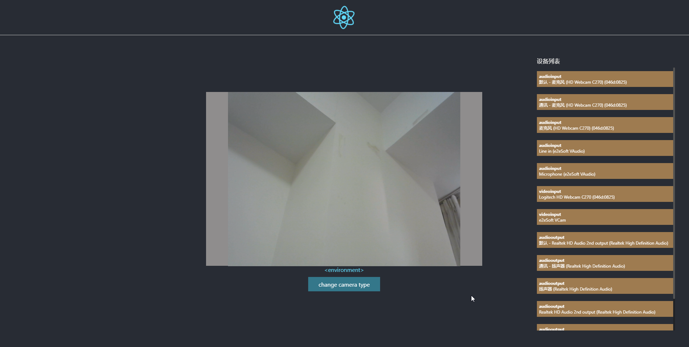
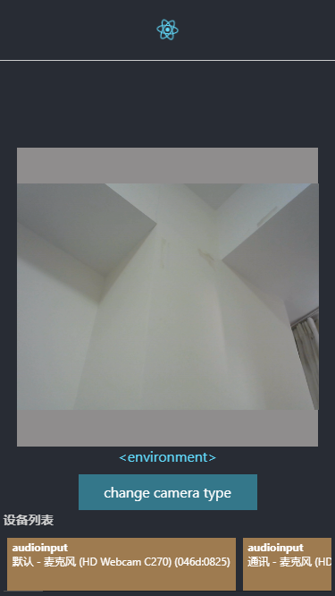

#### 获取设备媒体设备列表以及切换前后摄像头

>pc

>mobile

#### `steps`

`git clone => cd <projectName> => yarn`

如果在多设备调试，`navigator.getUserMedia`依赖于https,HTTPS环境变量设置为true后再正常启动项目：

#### `Windows (cmd.exe)`

>set HTTPS=true&&yarn start

#### `Windows (Powershell)`

>($env:HTTPS = "true") -and (yarn start)

#### `Linux, macOS (Bash)`

>HTTPS=true yarn start